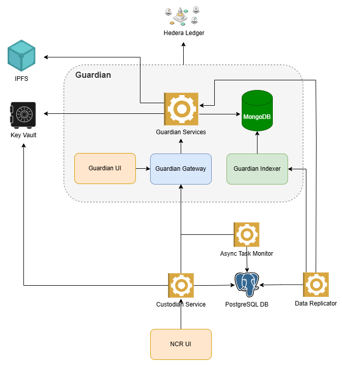
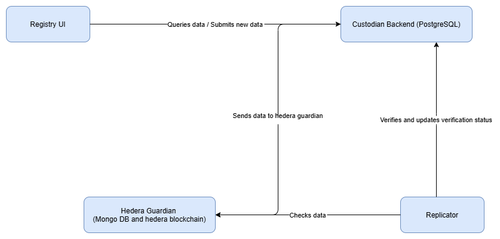
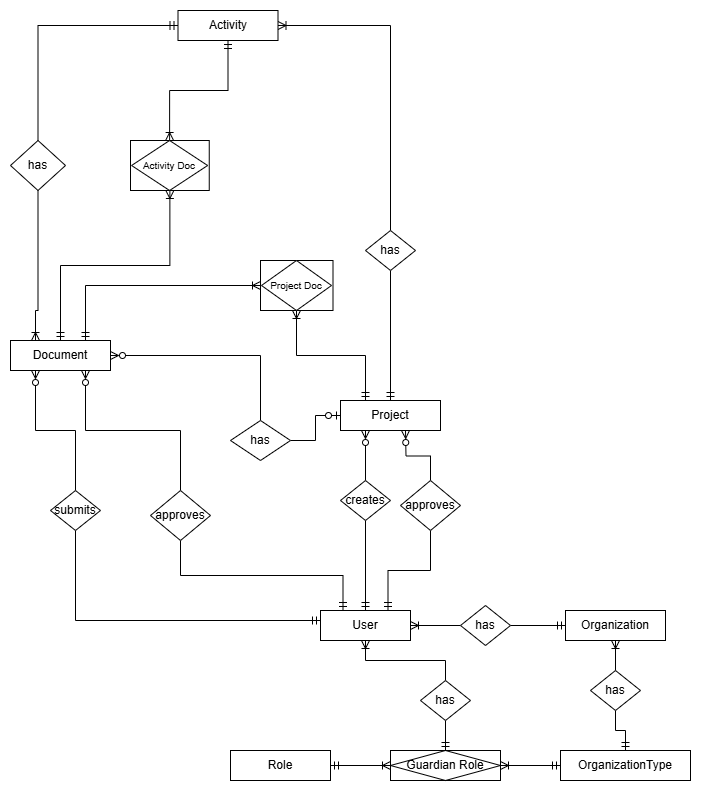

 
[](https://www.sparkblue.org/group/keeping-track-digital-public-goods-paris-agreement)
[](https://app.digitalpublicgoods.net/a/10403)

<a name="about"></a>

# National Carbon Credit Registry
The National Carbon Registry enables carbon credit trading to reduce greenhouse gas emissions. 

As an online database, the National Carbon Registry adheres to national and international standards for quantifying and verifying greenhouse gas emission reductions by projects. It tracks the issuance, holding, transfer, acquisition, cancellation, and retirement of carbon credits in an efficient and transparent manner. All data on mitigation projects and credit transactions is recorded and stored, ensuring that information is publicly accessible to boost confidence in the emissions reduction agenda. 

Now, with our new registry implementation, the familiar front-end and operational flow remain unchanged. However, the backend is being transformed—incorporating Guardian Policy for enhanced security and compliance and utilizing the Hedera blockchain as the ledger. Ultimately, NFTs will be created for each carbon credit to standardize, secure, and streamline cross-border carbon trading. In addition, a custodian wrapper will be introduced on the registry side to manage communication and logic with Guardian, ensuring seamless integration with national and international systems, MRV platforms, and more. 

The system continues to offer two key features: 
* **Analytics Dashboard:** Enabling governments, companies, and certification bodies to operate transparently and function on an immutable blockchain.

* **Serial Number Generator:** Standardizing the technical format to allow for easy cross-border collaboration between carbon trading systems.

## Index
* [About](#about)
* [Standards](#standards)
* [Architecture](#architecture)
* [Project Structure](#structure)
* [Run as Containers](#container)
* [Run Services Locally](#local)
* [Run Services on Cloud](#cloud)
* [User Onboarding](#user)
* [Web Frontend](#frontend)
* [Localization](#localization)
* [API](#api)
* [Status Page](#status)
* [Governance & Support](#support)

<a name="standards"></a>
## Standards
This codebase aims to fullfill the digital public goods standard:
https://digitalpublicgoods.net/standard/
It is built according to the Principles for Digital Development:
https://digitalprinciples.org/ 

<a name="architecture"></a>
## System Architecture
UNDP Carbon Registry is based on service oriented architecture (SOA). Following diagram visualize the basic components in the system.



<a name="services"></a>
### **System Services**
#### *Custodian*

Authenticate, Validate and Accept user (Designated National Authority, Project Developer and Independent Certifier) API requests related to the following functionalities,
- User and company CRUD operations.
- User authentication.
- Project life cycle management. 
- Credit life cycle management.

Service is horizontally scalable and state maintained in the following locations,
- File storage.
- Operational Database.
- Hedera Public Ledger.

Uses the Serial Number Generator node modules to estimate the project carbon credit amount and issue a serial number.
Uses Hedera Public Ledger to persist project and credit life cycles.

#### *Analytics Service*
Serve all the system analytics. Generate all the statistics using the operational database. Horizontally scalable.

#### *Async Task Monitor*
The task monitor will fetch pending tasks from the database and execute them in order. It will also consider task dependencies. 

#### *Data Replicator*
Asynchronously verify custodian database data by referring to the Hedera Guardian.


### **Deployment**
System services can deploy in 2 ways.
- **As a Container** - Each service boundary containerized in to a docker container and can deploy on any container orchestration service. [Please refer Docker Compose file](./docker-compose.yml)
- **As a Function** - Each service boundary packaged as a function (Serverless) and host on any Function As A Service (FaaS) stack. [Please refer Serverless configuration file](./backend/services/serverless.yml)


### **External Service Providers**
All the external services access through a generic interface. It will decouple the system implementation from the external services and enable extendability to multiple services.

**Geo Location Service** 

Currently implemented for 2 options.
1. File based approach. User has to manually add the regions with the geo coordinates. [Sample File](./backend/services/regions.csv). To apply new file changes, replicator service needs to restart. 
2. [Mapbox](https://mapbox.com). Dynamically query geo coordinates from the Mapbox API. 

Can add more options by implementing [location interface](./backend/services/src/shared/location/location.interface.ts)

Change by environment variable `LOCATION_SERVICE`. Supported types `MAPBOX`, `FILE(Default)`

**File Service**

Implemented 2 options for static file hosting.
1. NestJS static file hosting using the local storage and container volumes.
2. AWS S3 file storage.

Can add more options by implementing [file handler interface](./backend/services/src/shared/file-handler/filehandler.interface.ts)

Change by environment variable `FILE_SERVICE`. Supported types `S3`, `LOCAL(Default)`

### **Database Architecture**
Custodian database design.



### **Authentication**
- JWT Authentication - All endpoints based on role permissions.
- API Key Authentication - MRV System connectivity.

When signing in to Custodian, the user will also be signed in to Guardian. The refresh token for that session will be cached in Custodian for the duration of the session. 

<a name="structure"></a>
## Project Structure

    .
    ├── .github                         # CI/CD [Github Actions files]
    ├── deployment                      # Declarative configuration files for initial resource creation and setup [AWS Cloudformation]
    ├── backend                         # System service implementation
        ├── custodian                    # Services implementation [NestJS application]
            ├── apps
                ├── custodian        # API wrapper [NestJS module]      
                ├── task-monitor     # Asynchronous task monitor [NestJS module]
                ├── data-replicator  # Data replicator between guardian and custodian [NestJS module]
                
            ├── serverless.yml          # Service deployment scripts [Serverless + AWS Lambda]
    ├── libs
        ├── core    # Contains auth module and other commond modules [Node module + Typescript]
        ├── shared           # Contains all the backend modules, dtos and entities [Node module + Typescript]
    ├── web                             # System web frontend implementation [ReactJS]
    ├── .gitignore
    ├── docker-compose.yml              # Docker container definitions
    └── README.md

<a name="container"></a>
## Run Services As Containers
- Update [docker compose file](./docker-compose.yml) env variables as required.
    - Currently all the emails are disabled using env variable `IS_EMAIL_DISABLED`. When the emails are disabled email payload will be printed on the console. User account passwords needs to extract from this console log. Including root user account, search for a log line starting with ```Password (temporary)``` on national container (`docker logs -f undp-carbon-registry-national-1`). 
    - Add / update following environment variables to enable email functionality.
        - `IS_EMAIL_DISABLED`=false
        - `SOURCE_EMAIL` (Sender email address)
        - `SMTP_ENDPOINT`
        - `SMTP_USERNAME`
        - `SMTP_PASSWORD`
    - Use `DB_PASSWORD` env variable to change PostgresSQL database password
    - Configure system root account email by updating environment variable `ROOT EMAIL`. If the email service is enabled, on the first docker start, this email address will receive a new email with the root user password.
    - By default frontend does not show map images on dashboard and project view. To enable them please update `REACT_APP_MAP_TYPE` env variable to `Mapbox` and add new env variable `REACT_APP_MAPBOXGL_ACCESS_TOKEN` with [MapBox public access token](https://docs.mapbox.com/help/tutorials/get-started-tokens-api/) in web container. 

- Run `docker-compose up -d --build`. This will build and start containers for following services,
    - PostgresDB container
    - Custodian service
    - Task monitor service
    - Data Replicator service
    - React web server with Nginx. 
- Web frontend on http://localhost:3030/
- API Endpoints,
  - http://localhost:3000/

<a name="local"></a>
## Run Services Locally
- Setup postgreSQL locally and create a new database.
- Update following DB configurations in the .env.local file (If the file does not exist please create a new .env.local)
    - DB_HOST (Default localhost)
    - DB_PORT (Default 5432)
    - DB_USER (Default root)
    - DB_PASSWORD
    - DB_NAME (Default carbondbdev)
- Move to folder `cd backend/service`
- Run `yarn run sls:install `
- Initial user data setup `serverless invoke local --stage=local --function setup --data '{"rootEmail": "<Root user email>","systemCountryCode": "<System country Alpha 2 code>", "name": "<System country name>", "logoBase64": "<System country logo base64>"}'`
- Start all the services by executing `sls offline --stage=local`
- Now all the system services are up and running. Swagger documentation will be available on `http://localhost:3000/docs`

<a name="cloud"></a>
## Deploy System on the AWS Cloud
- Execute to create all the required resources on the AWS.
    ```
    aws cloudformation deploy --template-file ./deployment/aws-formation.yml --stack-name carbon-registry-basic --parameter-overrides EnvironmentName=<stage> DBPassword=<password> --capabilities CAPABILITY_NAMED_IAM
    ```
- Setup following Github Secrets to enable CI/CD
    - AWS_ACCESS_KEY_ID
    - AWS_SECRET_ACCESS_KEY
- Run it manually to deploy all the lambda services immediately. It will create 2 lambda layers and following lambda functions,
    - national-api: Handle all carbon registry user and program creation. Trigger by external http request.
    - replicator: Replicate Ledger database entries in to Postgres database for analytics. Trigger by new record on the Kinesis stream.
    - setup: Function to add initial system user data.
- Create initial user data in the system by invoking setup lambda function by executing
    ```
    aws lambda invoke \
        --function-name carbon-registry-services-dev-setup --cli-binary-format raw-in-base64-out\
        --payload '{"rootEmail": "<Root user email>","systemCountryCode": "<System country Alpha 2 code>", "name": "<System country name>", "logoBase64": "<System country logo base64>"}' \
        response.json
    ```


### Serial Number Generation
Serial Number generation implemented in a separate node module. [Please refer this](./libs/serial-number-gen/README.md) for more information.

<a name="external"></a>
## External Connectivity


#### <b>Assumptions</b>
- Project estimated credit amount is 100.
- Project issued credit amount is always 10.

#### <b>Docker Integration Setup</b>
1. Append `data-importer` to `docker-compose` file `replicator` service `RUN_MODULE` env variable with comma separated. 
2. Update following env variables in the `docker-compose` file `replicator` service.
    - ITMO_API_KEY
    - ITMO_EMAIL
    - ITMO_PASSWORD
    - ITMO_ENDPOINT
3. Projects will import on each docker restart. 

<a name="user"></a>
## User Onboarding and Permissions Model

### User Roles
System pre-defined user roles are as follows,
- Root
- Company Level (National Government, Project and Certification Company come under this level) 
    - Admin 
    - Manager 
    - View Only 

### User Onboarding Process
1. After the system setup, the system have a Root User for the setup email (one Root User for the system) 
2. Root User is responsible for creating the Government entity and the Admin of the Government 
3. The Government Admin is responsible for creating the other companies and Admins of each company. 
4. Admin of the company has the authority to add the remaining users (Admin, Managers, View Only Users) to the company. 
5. When a user is added to the system, a confirmation email should be sent to users including the login password. 


### User Management 

All the CRUD operations can be performed as per the following table,

| Company Role | New User Role | Authorized User Roles (Company) |
| --- | --- | --- |
| Government | Root | Cannot create new one other than the default system user and Can manage all the users in the system |
| Government | Admin<br>Manager<br>View Only | Root<br>Admin(Government) |
| All other Company Roles | Admin<br>Manager<br>View Only | Root<br>Admin(Government)<br>Admin(Company) |

- All users can edit own user account except Role and Email.
- Users are not allowed to delete the own account from the system.

<a name="frontend"></a>
### Web Frontend
Web frontend implemented using ReactJS framework. Please refer [getting started with react app](./web/README.md) for more information.

<a name="localization"></a>
### Localization
* Languages (Current): English
* Languages (In Progress): French. Spanish 
Please refer [here](./web/public/locales/i18n/README.md) for adding a new language translation file.

<a name="api"></a>
### Application Programming Interface (API)
For integration, reference RESTful Web API Documentation documentation via Swagger. To access
- National API: api.APP_URL/national
- Status API: api.APP_URL/stats

<a name="resource"></a>
### Resource Requirements

| Resource | Minimum | Recommended |
| :---         |           ---: |          ---: |
| Memory   | 4 GB    | 8 GB    |
| CPU     | 4 Cores       |   4 Cores   |
| Storage     |  20 GB       |   50 GB   |
| OS     | Linux <br> Windows Server 2016 and later versions.      |      |

Note: Above resource requirement mentioned for a single instance from each microservice.

<a name="status"></a>
### Status Page
For transparent uptime monitoring go to status.APP_URL
Open source code available at https://github.com/undp/carbon-registry-status

<a name="support"></a>
### Governance and Support
[Digital For Climate (D4C)](https://www.theclimatewarehouse.org/work/digital-4-climate) is responsible for managing the application. D4C is a collaboration between the [European Bank for Reconstruction and Development (EBRD)](https://www.ebrd.com), [United Nations Development Program (UNDP)](https://www.undp.org), [United Nations Framework Convention on Climate Change (UNFCCC)](https://www.unfccc.int), [International Emissions Trading Association (IETA)](https://www.ieta.org), [European Space Agency (ESA)](https://www.esa.int), and [World Bank Group](https://www.worldbank.org) that aims to coordinate respective workflows and create a modular and interoperable end-to-end digital ecosystem for the carbon market. The overarching goal is to support a transparent, high integrity global carbon market that can channel capital for impactful climate action and low-carbon development. 

This code is managed by [United Nations Development Programme](https://www.undp.org) as custodian. For any questions, contact us at digital@undp.org .
