# Article 6.2 User Testing Walkthrough — with screenshots

This is a screenshot-driven manual QA walkthrough of the Article 6.2 surfaces in
the UNDP National Carbon Registry. It complements the leaner checklist in
[`manual-qa-article6.md`](./manual-qa-article6.md): use that as the test plan,
this as the visual oracle against which to compare.

All screenshots were captured with Playwright MCP against the local Podman stack
described in `docker-compose.yml` and the demo seeded by `scripts/seed-demo.sh`.
Resolution: 1440 × 900.

## Prerequisites

1. The stack is running:
   ```bash
   podman-compose up -d db replicator national web
   ```
2. Demo data is seeded:
   ```bash
   ./scripts/seed-demo.sh
   ```
3. Browser at `http://localhost:3030`.

## Accounts (seeded)

| Email | Password | Role | Use for |
|---|---|---|---|
| `palinda+add@xeptagon.com` | `123` | DNA Admin | §1, §2, §3, §4, §6 (approve), §7, §8, §10 |
| `palinda+dev@xeptagon.com` | `123` | PD Admin (Org 2) | §5 (transfer), §6 (initiate) |
| `palinda+dev2@xeptagon.com` | `123` | PD Admin (Org 3) | §5 (recipient verification) |
| `palinda+cet@xeptagon.com` | `123` | Independent Certifier | §9 |
| `palinda+view@xeptagon.com` | `123` | DNA ViewOnly | §9 |
| `palinda+ministry@xeptagon.com` | `123` | Ministry | §9 |

## Seeded data summary

- **3 cooperative approaches**: `CA-001` Active (Ghana–Switzerland), `CA-002` Active (Nigeria–Japan), `CA-003` Suspended (test).
- **2 initial reports**: `IR-001` Submitted (CA-001), `IR-002` Submitted (CA-002).
- **4 programmes**: `001` Pending, `002` Approved, `003` Authorised, `004` Authorised + Issued.
- **3 credit blocks** for project 004: `BLK-DEMO-D-HOLD` 930 Holding, `BLK-DEMO-D-OMGE` 20 OMGE, `BLK-DEMO-D-SOP` 50 SOP.
- **1 corresponding adjustment** record: `CA-ADJ-001`.

> Some screenshots in this doc were captured part-way through prior tests, so
> credit balances and serial ranges may differ from a freshly seeded run. The
> structural elements (columns, controls, gates) are what's under test.

---

## §0 — Login

`http://localhost:3030/login` shows the marketing image on the left and the Sign In
form on the right. Fill in any of the seeded accounts above.

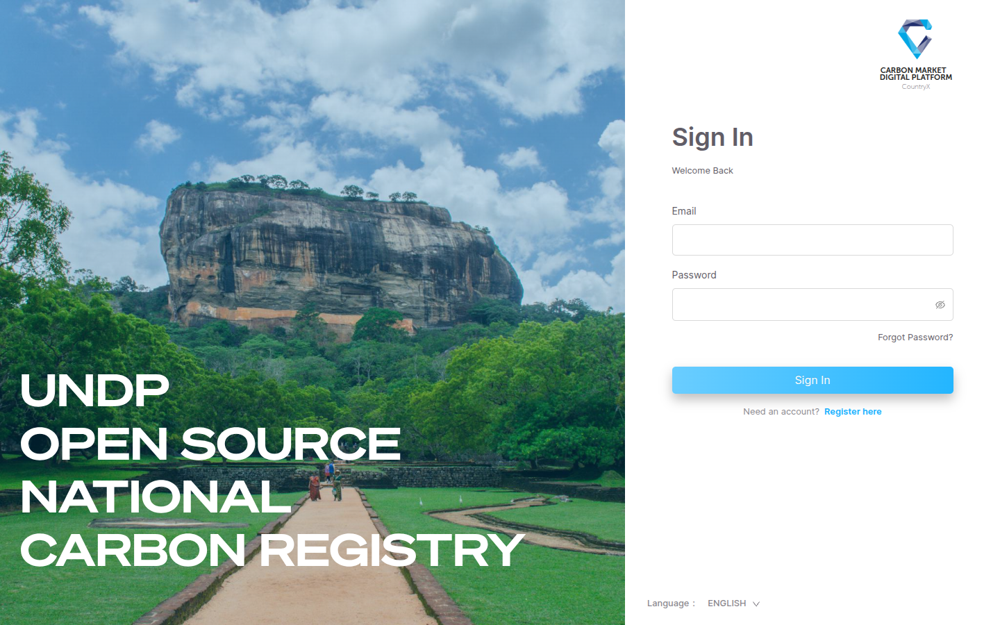

Logging in as DNA Admin (`palinda+add@xeptagon.com`) lands on `/dashboard` with the
full sidebar (Reports, Corresponding Adjustments, Initial Reports all visible).

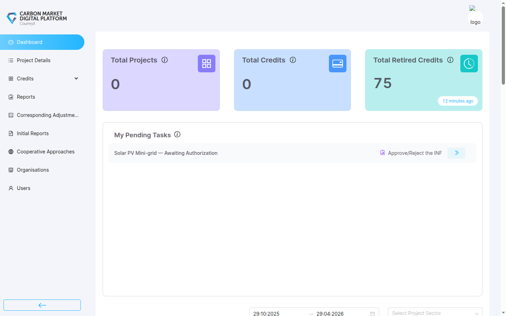

---

## §1 — Cooperative Approach lifecycle (Decision 2/CMA.3 ¶¶ 1, 18)

**Login**: DNA Admin.

### List

Sidebar → **Cooperative Approaches**. URL `/cooperativeApproaches/viewAll`.

Expected: 3 rows — `CA-001 Active`, `CA-002 Active`, `CA-003 Suspended`. Status tags
coloured green / green / orange.

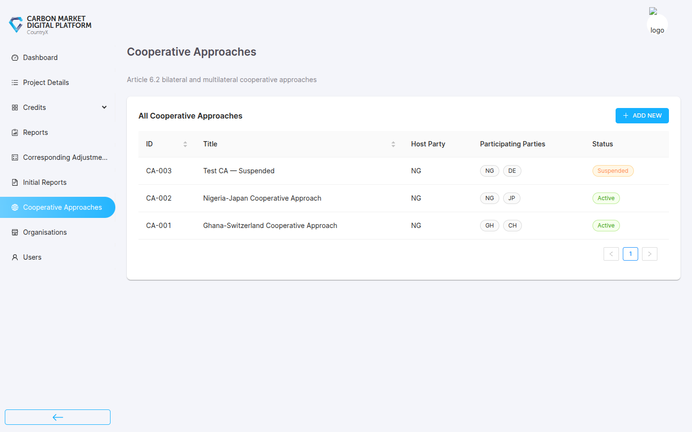

### Detail page (Completed)

For the screenshot below, CA-002 has been driven to `Completed` to demonstrate
the new transition-rejection toast. The detail page renders the CA's metadata
in a bordered Descriptions table. The Status select allows DNA admins to
transition between non-terminal states.

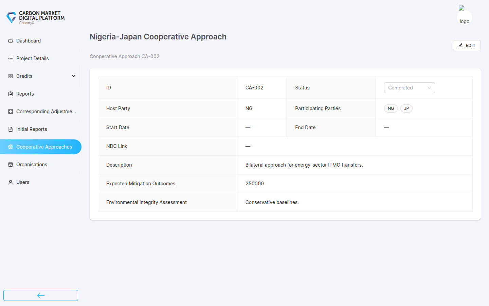

### Negative — Completed → Active

Clicking the Status combobox and picking `Active` triggers the new actionable
error toast wired up in commit `ab6b67d7a`. The message resolves from
`backend/.../i18n/en/cooperativeApproach.json: transitionFromCompleted`.

> "Cooperative approach CA-002 is Completed — its lifecycle has ended and its
> status cannot change. To start a new bilateral arrangement, create a fresh
> cooperative approach."

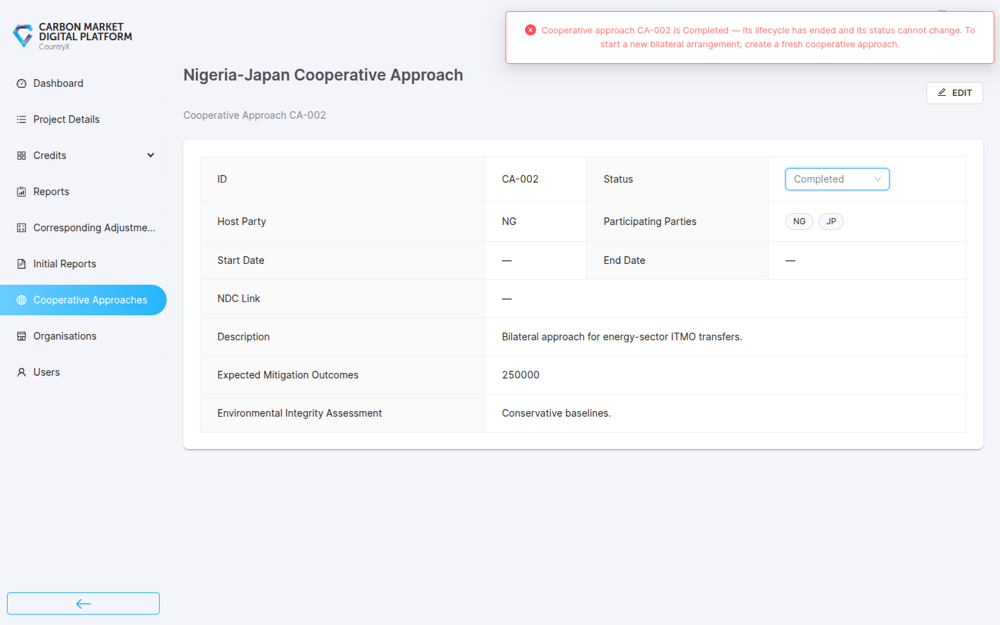

The same pattern fires for `Revoked → anything` (key
`cooperativeApproach.transitionFromRevoked`) and `revert-to-Draft` (key
`cooperativeApproach.transitionRevertToDraft`).

**Pass criteria**: 3 rows visible; valid transitions persist; terminal-state
attempts surface the new specific text.

---

## §2 — Initial Report — para 18 enforcement & new create form (Decision 2/CMA.3 ¶ 18)

**Login**: DNA Admin.

The IR create form was rewritten in commit `38bf6e792` to:
- replace the free-text CA-id input with a populated dropdown,
- pre-fill CA-derived fields and the Environmental Integrity textarea,
- enforce four client-side validation rules before contacting the server.

### Empty form

Sidebar → **Initial Reports** → **Generate Report** (top right of list page).
The form renders with the CA dropdown unselected and all numeric fields empty.

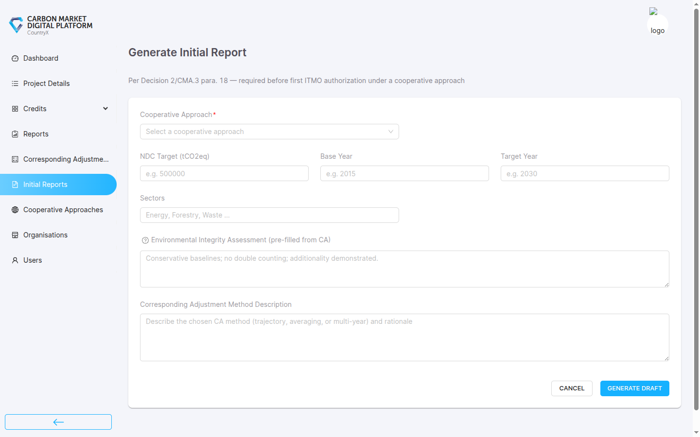

### CA dropdown

Click the **Cooperative Approach** dropdown. The Select is populated from
`POST /national/cooperativeApproach/query` and shows id + title + status for
each CA so the user can pick the right one without leaving the page.

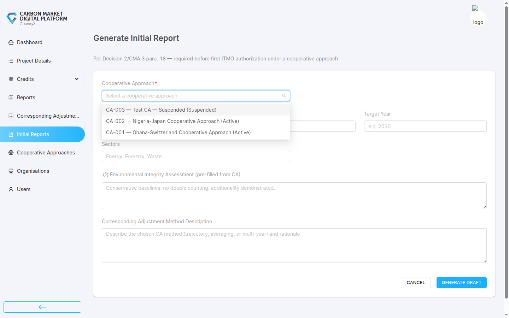

### Picking a Suspended CA

Picking `CA-003 — Test CA — Suspended (Suspended)` triggers two visual signals:
- a red `Alert` banner: "Cooperative approach CA-003 is Suspended. An initial
  report can only be generated for an Active cooperative approach. Reactivate
  the CA or pick a different one."
- the **Generate Draft** button is disabled.

The Descriptions panel still renders so the user can confirm they picked the
intended CA. The Environmental Integrity Assessment textarea pre-fills from
`approach.environmentalIntegrityAssessment`.

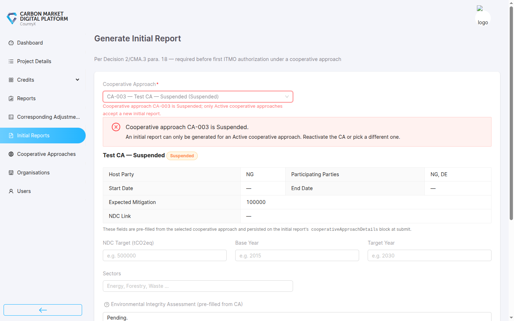

### Picking an Active CA — autofill

Picking an Active CA clears the alert and fills the panel:

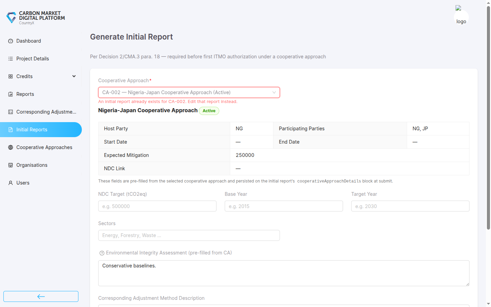

In this screenshot CA-002 was picked. Notice the inline validator firing under
the dropdown: "An initial report already exists for CA-002. Edit that report
instead." This is the new client-side preflight check that hits
`/initialReport/query` for the chosen CA before letting the user submit, so
the user catches the duplicate-IR conflict (which would otherwise 409 from the
server) at pick-time.

### Cross-field validation

Filling `Base Year = 2030` and `Target Year = 2020` raises the inline error
"Target year must be greater than base year" before the request goes out.

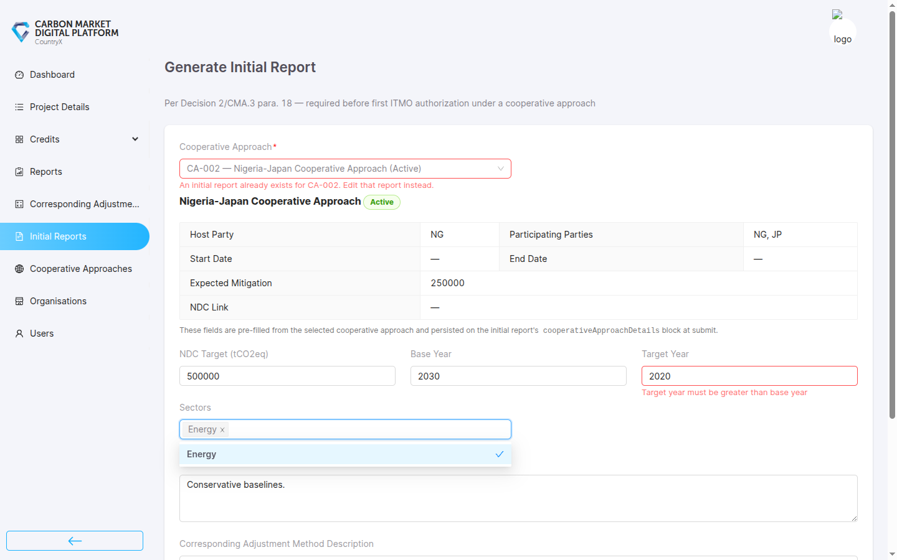

**Pass criteria**: dropdown populates; Suspended CA shows red alert + disables
Submit; Active CA pre-fills the Descriptions panel + env-integrity textarea;
existing-IR preflight catches duplicates; cross-field year rule fires.

---

## §3 — Programme authorization — para 18 + revoked-CA + suspended-CA gates (Decision 2/CMA.3 ¶ 18, Draft -/CMA.5 ¶¶ 20–21)

**Login**: DNA Admin.

### General card on the project detail page

Sidebar → **Project Details** → click row `002` (Mangrove Reforestation —
Approved). The General card on the right column shows the Cooperative Approach
+ Authorization Purpose at the bottom.

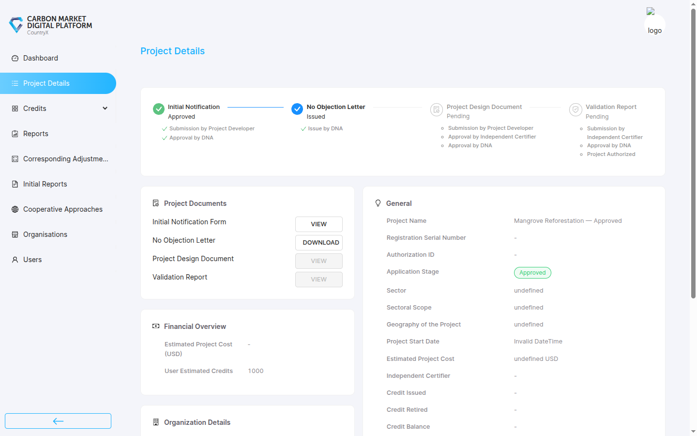

### Authorize gate messages (commit `ab6b67d7a`)

Driving CA-001 to Suspended via the Cooperative Approaches detail page, then
attempting to authorize project 002, fires the new toast:

> "Cooperative approach CA-001 is Suspended. Suspension is temporary;
> reactivate the cooperative approach (Active) before authorizing programmes
> under it (Draft -/CMA.5 para 20)."

The Revoked variant cites para 21 and tells the user to "Use a different
cooperative approach for this programme." The article6trade-without-CA gate
names the programme id and instructs the user to link a CA before authorizing.
Each message is sourced from `programme.json` (`caSuspendedBlocksAuth`,
`caRevokedBlocksAuth`, `article6CaRequiredForAuth`,
`noSubmittedIrForCaAuth`).

**Pass criteria**: General card shows CA + Authorization Purpose on every
Article 6.2 project; Suspended/Revoked/missing-IR/no-CA gates each fire with
their specific message; double-authorize is rejected.

---

## §4 — Credit issuance — structured ITMO serial + OMGE/SOP deductions (Decision 2/CMA.3 ¶ 4, 3/CMA.3 ¶ 1, 6/CMA.4 Annex I ¶ 5)

**Login**: DNA Admin.

Sidebar → **Credits ▸ Credit Balance**.

The screenshot below was taken after some prior test transfers/retires so the
balances have shifted from the seed values; the structural elements to verify
are: structured serials of the form `<party>-<unit>-<scope>-<projectId>-<startSerial>-<endSerial>-<vintage>`,
the All Accounts dropdown, and the Issued/Received filter checkboxes.

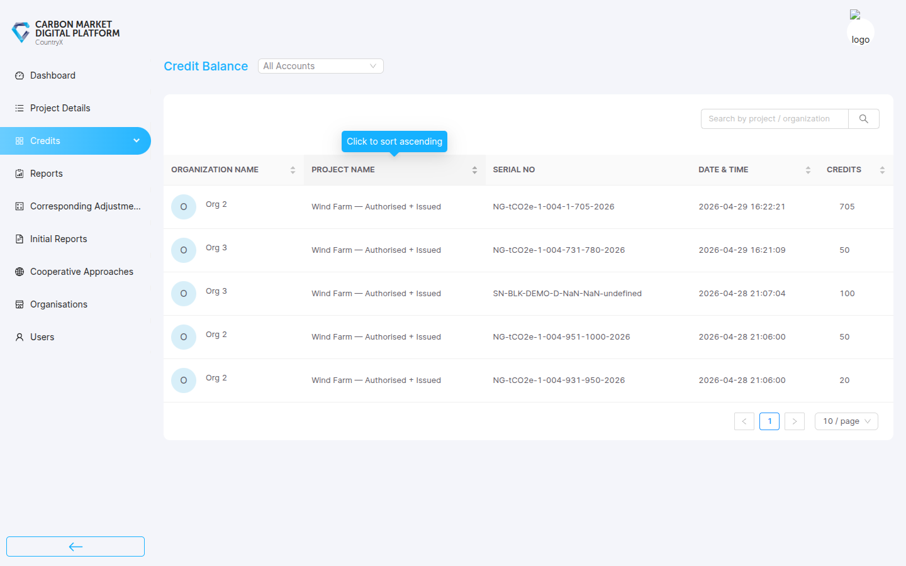

> The legacy `SN-BLK-DEMO-D-NaN-NaN-undefined` row visible here is leftover
> data from an early-session transfer that ran before commit `dab6ca60f`
> patched the seeder's serial format. New seeds don't produce that shape.

**Pass criteria**: 3 rows visible after a fresh seed (Holding 930 / OMGE 20 /
SOP 50); structured serial parses to 7 dash-separated parts; arithmetic
reconciles against issuance.

---

## §5 — Credit transfer (Decision 2/CMA.3 Annex ¶ 1(a))

**Login**: PD Admin (Org 2).

### Transfer modal

On the Holding row click the **⋯** ellipsis → **Transfer**. Modal opens with the
Project read-only, the recipient dropdown, a Credit Amount spinner, and a
Remark textarea.

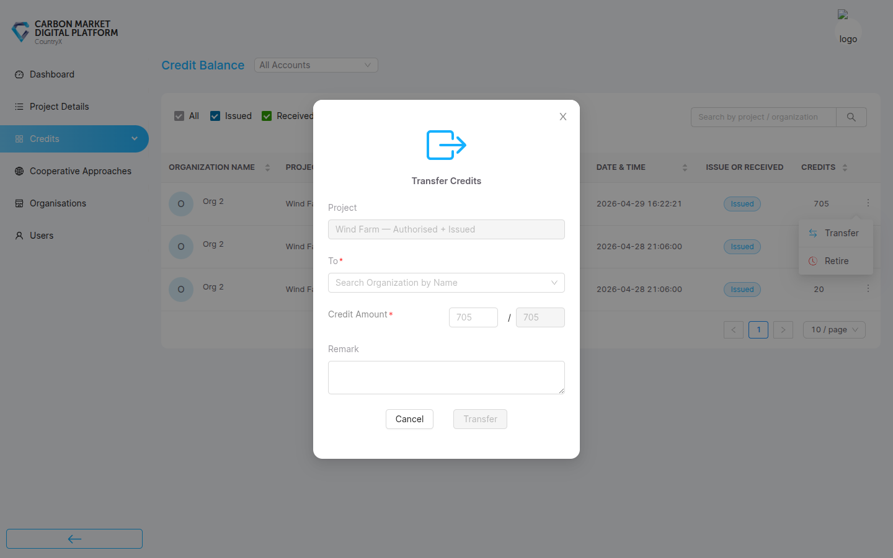

### Negative — self-transfer

Trying to transfer to your own organisation surfaces the new toast wired up in
commit `ab6b67d7a` (key `creditTransaction.selfTransferRejected`):

> "You cannot transfer credits to your own organisation. Pick a different
> recipient."

### Negative — Revoked-CA transfer

Once the linked CA is Revoked, transfer attempts on a block carrying that
`cooperativeApproachId` fire (key `creditTransaction.transferFromRevokedCa`):

> "Credit block `<blockId>` was issued under cooperative approach `<caId>`,
> which has since been Revoked. ITMO transfers from a Revoked CA are not
> permitted (Draft -/CMA.5 para 21)."

**Pass criteria**: synchronous transfer flips ownership immediately; overdraw,
self-transfer, and Revoked-CA transfer each surface their specific rejection.

---

## §6 — Retirement — six types + DNA approval flow (Decision 2/CMA.3 ¶ 1, 4/CMA.6 Annex II)

**Login**: PD Admin (Org 2).

### Retire modal

On the Holding row click **⋯** → **Retire**. The modal shows all six
retirement-type radios (`Cross-Border Transactions`, `Voluntary
Cancellations`, `Use Towards NDC`, `Use For OIMP`, `OMGE Cancellation`, `SOP
Adaptation`), Country/Organisation fields (only required for Cross-Border),
amount + remark, and a "pending DNA approval" checkbox.

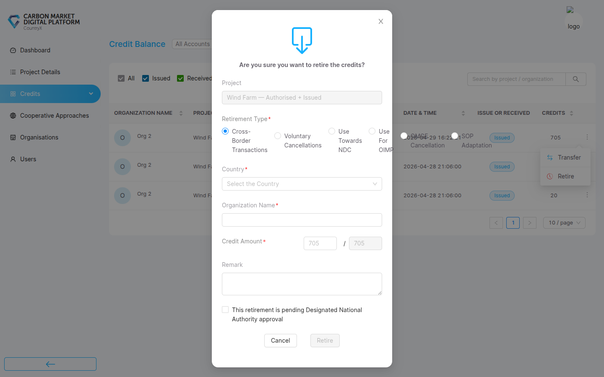

### DNA approval — Retirements list

Switch to DNA Admin and open Sidebar → **Credits ▸ Retirements**. The list
shows the two retirements approved during the prior regression run (refs `5`
and `7`, both Use Towards NDC, both Completed).

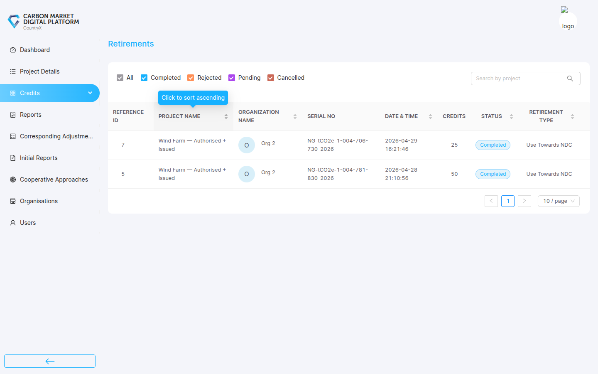

The DNA approval flow: click the row's **⋯** → **Accept** → tick the
"I understand…" checkbox → Proceed. A new `RetirementNDC` block is created
under the synthetic owner companyId 0 (the retired pool), and the source
Holding block's `creditAmount` is decremented.

**Pass criteria**: 6 retirement-type radios; PD initiates Pending row; DNA
Accept creates a `RetirementNDC` block; overdraw is rejected.

---

## §7 — Corresponding Adjustment (Decision 2/CMA.3 ¶¶ 7–10)

**Login**: DNA Admin.

Sidebar → **Corresponding Adjustments**. URL
`/correspondingAdjustments/viewAll`. The seeded `CA-ADJ-001` row is visible
with the year, linked CA, NDC type, CA method, emissions balance, safeguard
status, and overall record status.

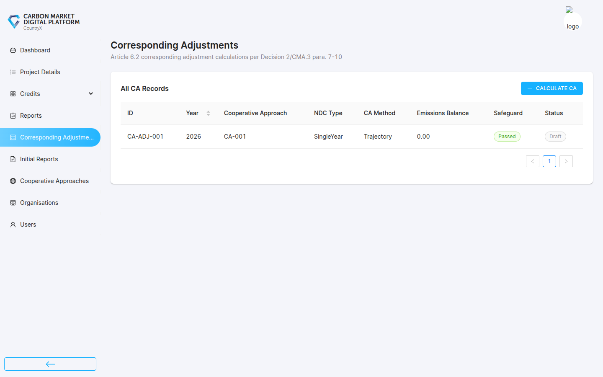

> Known existing UX gap: the row click handler navigates to a route
> (`/correspondingAdjustments/view/:caId`) that isn't registered in the SPA
> router, so clicking falls through to the marketing landing page. The
> `+ Calculate CA` action (top right) for creating a new record works.

**Pass criteria**: list shows the seeded CA-ADJ row with the right columns.

---

## §8 — AEF Reports (Decision 4/CMA.6 Annex II)

**Login**: DNA Admin.

Sidebar → **Reports**. The page renders the Article 6 Annual Information +
Actions + Holdings reports for the configured reporting year, with Export
buttons (Excel, CSV).

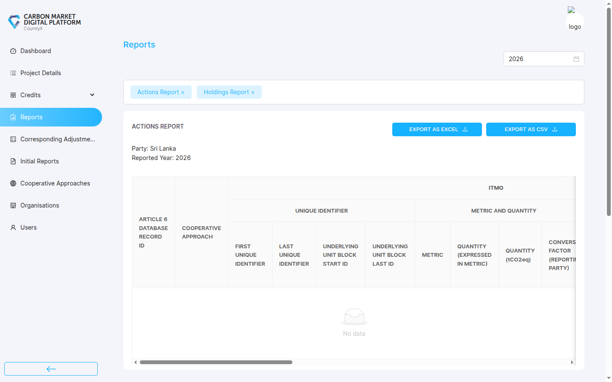

The columns mirror the AEF schema: `ARTICLE 6 DATABASE RECORD ID`,
`COOPERATIVE APPROACH`, ITMO `UNIQUE IDENTIFIER` block, `METRIC AND QUANTITY`
block, etc.

**Pass criteria**: page renders without error; the three report types are
toggleable; the column structure matches the AEF spec.

---

## §9 — CASL spot-checks across roles

Each role shows a different subset of the sidebar. Reports / Corresponding
Adjustments / Initial Reports are DNA-only by design.

### DNA Admin

Full sidebar. Reports / Corresponding Adjustments / Initial Reports visible.

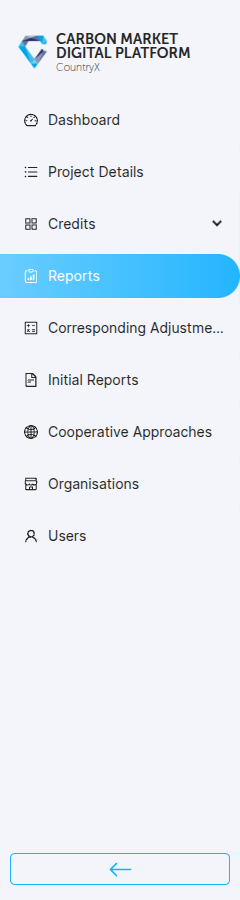

### PD Admin

DNA-only items hidden. Credits remains because PD is the holder of issued
credits.

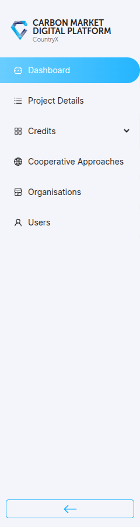

### Independent Certifier

No Credits, no DNA-only items. ICs see Project Details for review purposes
and Cooperative Approaches for context.

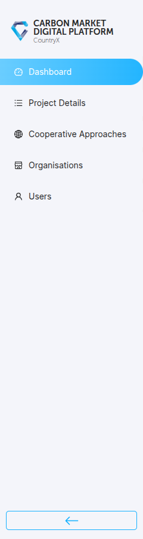

### DNA ViewOnly

Same chrome as DNA Admin minus the create/update affordances within each
page (e.g. status comboboxes are disabled). Notice that DNA-only items
(Reports / Corresponding Adjustments / Initial Reports) are still hidden in
this build — UX gap noted in the audit.


### Ministry

Mirrors PD-style sidebar today. No DNA-only items, no Credits. The Audit
also flagged this as a UX gap if Ministry is expected to mirror DNA.


**Pass criteria**: each role sees the expected sidebar subset; force-nav to
DNA-only routes results in either an empty page render or 401/403 from the
API. Note: `/national/initialReport/query` currently returns IR data to PD
admin — flagged as a CASL leak in the audit, not yet fixed.

---

## §10 — UI regression sentinels

**Login**: DNA Admin.

### Empty-state search

Sidebar → **Project Details** → search `EMPTY-LIST-XYZ`. Expected: AntD's
`No Projects` empty placeholder, no white-screen.

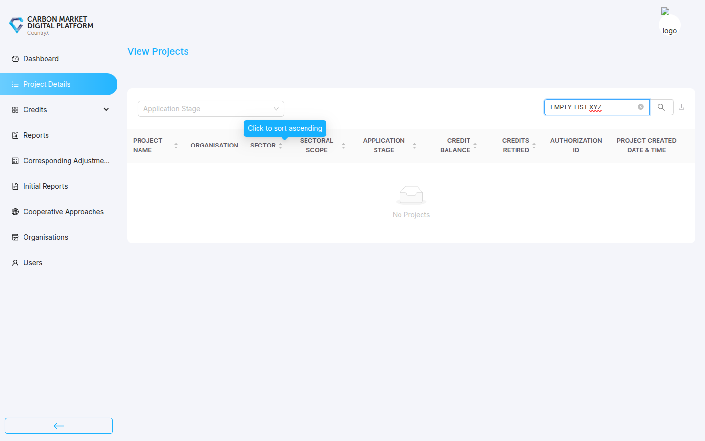

### Bogus project ID

Navigating to `/programmeManagement/view/TEST-PROJ-XXX` — a project id that
doesn't exist — currently renders an empty `<main>` with a 404 from
`/national/projectManagement/getProjectById`. No crash, no error boundary,
but no graceful "Project not found" empty state either. Existing UX gap.

### Project 004 detail

Navigating to `/programmeManagement/view/004` renders all six cards: Credits,
Project Documents, Financial Overview, Organization Details, General,
Activity Timeline. See the §3 screenshot above for the full layout.

**Pass criteria**: empty state renders cleanly; project 004 detail loads all
cards; bogus id doesn't crash.

---

## Sign-off table

| § | Verified | Date | Notes |
|---|---|---|---|
| 1 | | | |
| 2 | | | |
| 3 | | | |
| 4 | | | |
| 5 | | | |
| 6 | | | |
| 7 | | | |
| 8 | | | |
| 9 | | | |
| 10 | | | |

**Tester**: ____________  **Build SHA**: `git rev-parse HEAD`

---

## Provenance

- All English error text is resolved server-side via
  `backend/services/libs/shared/src/i18n/en/<namespace>.json`
  (`cooperativeApproach.json`, `programme.json`, `creditTransaction.json`).
- The web fallback toasts (`cooperativeApproachCreateFailed`,
  `cooperativeApproachUpdateFailed`) live in
  `web/public/locales/i18n/common/<lang>.json` for `en`, `es`, `fr`.
- The IR autofill + JS validation lives in
  `web/src/Pages/InitialReport/createInitialReport.tsx`.
- Screenshots in this doc were captured against commit `38bf6e792` of branch
  `article6/tests`.
